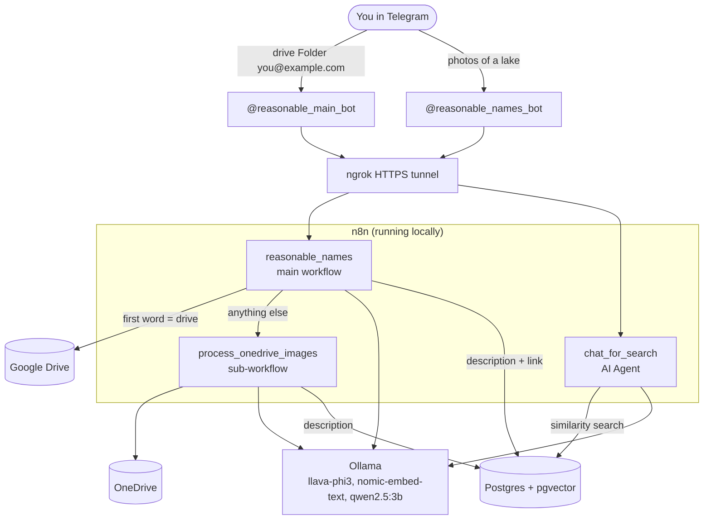

# reasonable_names

**Rename photos in Google Drive or OneDrive with a local AI vision model, straight from Telegram, and search them later in plain English.**


-black)

Photo archives are full of names like `IMG_4821.jpg`. You send one Telegram message with a storage type and a folder name. The pipeline looks at every image in that folder, gives it a short descriptive name (`sunset_over_calm_lake.jpg`) and renames the file in your cloud drive. It also saves a text description of each photo in a vector database. A second Telegram bot uses that database to answer questions like *"find photos with a lake and trees"* and replies with the matching photos and links.

Everything AI-related runs **locally** through [Ollama](https://ollama.com): no photo is sent to a third-party AI service unless you choose to swap the model (see [Swap the AI model](#swap-the-ai-model)).


---

## Table of contents

1. [What you get](#what-you-get)
2. [How it works](#how-it-works)
3. [Repository layout](#repository-layout)
4. [Requirements](#requirements)
5. [Setup](#setup)
   - [1. Ollama](#1-ollama)
   - [2. Postgres with pgvector](#2-postgres-with-pgvector)
   - [3. n8n and the ngrok tunnel](#3-n8n-and-the-ngrok-tunnel)
   - [4. The two Telegram bots](#4-the-two-telegram-bots)
   - [5. Google Drive credentials](#5-google-drive-credentials)
   - [6. OneDrive credentials (Azure)](#6-onedrive-credentials-azure)
   - [7. Import the workflows](#7-import-the-workflows)
   - [8. Connect credentials to nodes](#8-connect-credentials-to-nodes)
   - [9. Publish](#9-publish)
   - [Optional: Docker Compose](#optional-docker-compose)
6. [Usage](#usage)
7. [The naming prompt and its rules](#the-naming-prompt-and-its-rules)
8. [Swap the AI model](#swap-the-ai-model)
9. [Performance and memory tips](#performance-and-memory-tips)
10. [Troubleshooting](#troubleshooting)
11. [Known limitations](#known-limitations)
12. [Security and privacy](#security-and-privacy)
13. [Roadmap](#roadmap)
14. [License](#license)
15. [Author](#author)

---

## What you get

- **Rename bot, [@reasonable_main_bot](https://t.me/reasonable_main_bot).** Send `drive Holiday you@example.com` or `onedrive Holiday you@example.com`. Every image in that folder is analyzed and renamed.
- **Search bot, [@reasonable_names_bot](https://t.me/reasonable_names_bot).** Ask in plain English, for example `photos of the sea`. It returns up to 3 matching photos, each with a name, a link and a description.
- **Two clouds, one pipeline.** Google Drive is handled by the main workflow and OneDrive by a sub-workflow that the main workflow calls.
- **Local AI.** Vision: `llava-phi3`. Embeddings: `nomic-embed-text`. Search chat model: `qwen2.5:3b`. Any of them can be changed.
- **Built for small GPUs.** Developed on an RTX 3050 Laptop GPU (4 GB VRAM) and 16 GB RAM, with one image processed at a time.
- **Safe on mixed folders.** Non-image files (videos, documents) are skipped, and a folder that does not exist gives a clear Telegram message.

## How it works



### The three workflows

| Workflow | Entry point | Telegram bot | What it does |
|---|---|---|---|
| `reasonable_names` | Telegram Trigger | @reasonable_main_bot | Parses the message, finds the folder, loops over its files, analyzes and renames images in Google Drive, stores descriptions in pgvector. For OneDrive it calls the sub-workflow. |
| `process_onedrive_images` | Execute Workflow Trigger (called by the main workflow) | uses the same bot only to send messages | The same pipeline for OneDrive: checks the folder, lists items, downloads each image, analyzes, renames, stores the description. |
| `chat_for_search` | Telegram Trigger | @reasonable_names_bot | An AI Agent with a pgvector search tool. It embeds your question, finds the closest photo descriptions and replies. |

### Main workflow, step by step (Google Drive)

1. **Telegram Trigger** receives your message.
2. **Edit Fields1** splits the text on spaces into `storage`, `folder` and `email`.
3. **skip /start**: a message that is just `/start` is ignored.
4. **If**: when `storage` equals `drive` (not case-sensitive), the Google Drive branch runs. Any other value runs the OneDrive branch.
5. **Get folder name** searches Drive for the folder by name. **check if folder exists** checks that an `id` came back. If not, you get a "folder doesn't exist or wrong typing" message.
6. **get files in folder** lists every file in the folder (`id`, `name`, `mimeType`, `webViewLink`).
7. **Loop Over Items** takes one file at a time.
8. **check for only images** passes files whose MIME type starts with `image/`. Everything else goes to a No-Op node and the loop continues.
9. **Download file** fetches the image as binary data.
10. **Analyze image** sends the image and the naming prompt to `llava-phi3` through Ollama.
11. **Edit Fields** extracts `id`, `name`, `description` and `link` from the model's reply with tolerant regular expressions. It copes with Markdown code fences and with `"a" + "b"` string concatenation that small models sometimes produce. If the name has no image extension, `.jpg` is added.
12. In parallel, **Update image name** renames the file in Drive, and **Postgres PGVector Store** embeds `description` plus `link` with `nomic-embed-text` and saves them.
13. When the loop finishes, **Send a text message1** sends "All images renamed".

### OneDrive branch

The main workflow runs **Search a folder** (OneDrive) and then **Call 'process_onedrive_images'**, which waits for the sub-workflow to finish. The sub-workflow:

1. checks the folder `id` (**If1**) and sends a "folder doesn't exist" message when it is empty;
2. runs **Get a file** and **Get items in a folder**;
3. loops over the items and keeps only `file.mimeType` starting with `image/`;
4. downloads each image with an **HTTP Request** to the item's `@microsoft.graph.downloadUrl`. The OneDrive Download node failed with "Invalid request" in testing, so this is deliberate;
5. runs the same **Analyze image** and **Edit Fields** steps as the main workflow, then **Rename a file** and saves the description to pgvector.

### Search workflow

1. **Telegram Trigger** receives your question.
2. **AI Agent** (model: **Ollama Chat Model**, `qwen2.5:3b`) uses the question as its prompt.
3. The agent calls the **search_image** tool, a pgvector store in *retrieve-as-tool* mode that returns the 3 closest results (`topK = 3`). It uses `nomic-embed-text` embeddings, the same model used when the photos were indexed.
4. The tool description tells the agent to return each photo as *name, link, description*, to skip duplicate links and to invent nothing.
5. **Send a text message** replies in Telegram.

---

## Repository layout

```
reasonable_names/
├── README.md
├── LICENSE                        Apache 2.0
├── docker-compose.yml             optional one-command setup
├── init.sql                       enables the pgvector extension
├── docs/
│   └── main-workflow.png          screenshot of the main workflow
└── workflows/
    ├── reasonable_names.json          main workflow (Telegram + Google Drive)
    ├── process_onedrive_images.json   sub-workflow (OneDrive)
    └── chat_for_search.json           search bot (RAG chat)
```

The workflow JSON files contain **credential names and IDs only, never secrets**. Tokens, client secrets and passwords stay in your own n8n instance.

## Requirements

**Hardware.** Any computer that can run Ollama. A GPU is strongly recommended for the vision model. 16 GB of RAM is comfortable.

**Software and accounts**

| Needed | Used for |
|---|---|
| [n8n](https://n8n.io) (self-hosted) | Runs the workflows. Built and tested on n8n 2.x (2.40.6). |
| [Ollama](https://ollama.com) | Local AI models. |
| PostgreSQL with the `pgvector` extension | Stores photo descriptions as vectors. |
| [ngrok](https://ngrok.com) (or any HTTPS tunnel) | Telegram can only call webhooks over public HTTPS, so a local n8n needs a tunnel. |
| Two Telegram bots | One per Telegram Trigger. Telegram allows only one webhook per bot. |
| Google Cloud project | OAuth for Google Drive. |
| Azure app registration | OAuth for OneDrive (needed only if you use OneDrive). |

---

## Setup

### 1. Ollama

Install Ollama, then pull the three models:

```bash
ollama pull llava-phi3        # vision: looks at the photo and names it
ollama pull nomic-embed-text  # embeddings (768 dimensions) for search
ollama pull qwen2.5:3b        # chat model with tool calling for the search bot
```

Check that it is running: open `http://localhost:11434` in a browser. It should answer "Ollama is running".

In n8n you will create one **Ollama API** credential:

| n8n runs... | Base URL |
|---|---|
| directly on your computer | `http://localhost:11434` |
| in Docker, Ollama on the host | `http://host.docker.internal:11434` |
| in the Docker Compose stack from this repo | `http://ollama:11434` |

### 2. Postgres with pgvector

The quickest way is a Docker container:

```bash
docker run -d --name pgvector-db \
  -e POSTGRES_PASSWORD=yourpassword \
  -e POSTGRES_DB=vectordb \
  -p 5432:5432 \
  pgvector/pgvector:pg16
```

Enable the extension once:

```bash
docker exec -it pgvector-db psql -U postgres -d vectordb -c "CREATE EXTENSION IF NOT EXISTS vector;"
```

Create a **Postgres** credential in n8n (host `localhost`, port `5432`, database `vectordb`, user `postgres` and your password). If n8n itself runs in Docker, use `host.docker.internal` as the host instead of `localhost`.

The PGVector nodes create their table automatically on the first insert. Both the indexing nodes (in `reasonable_names` and `process_onedrive_images`) and the search tool (in `chat_for_search`) use the default table, so they share the same data.

### 3. n8n and the ngrok tunnel

Telegram sends messages to n8n through a **webhook**, and Telegram only accepts public **HTTPS** URLs. Your n8n runs on `localhost:5678`, so ngrok exposes it.

**a) Start the tunnel**

```bash
ngrok http 5678
```

Copy the `https://....ngrok-free.app` address it prints.

> Free ngrok accounts can claim one static domain in the ngrok dashboard. Use it: `ngrok http --url=your-name.ngrok-free.app 5678` (older ngrok versions use `--domain`). Without a static domain the address changes every time ngrok restarts, and you will have to republish the Telegram workflows each time (see [Troubleshooting](#troubleshooting)).

**b) Start n8n with `WEBHOOK_URL` set to that address**

macOS or Linux:

```bash
export WEBHOOK_URL=https://your-name.ngrok-free.app
n8n start
```

Windows PowerShell:

```powershell
$env:WEBHOOK_URL = "https://your-name.ngrok-free.app"
n8n start
```

Docker:

```bash
docker run -it --rm -p 5678:5678 \
  -e WEBHOOK_URL=https://your-name.ngrok-free.app \
  -v n8n_data:/home/node/.n8n \
  docker.n8n.io/n8nio/n8n
```

Without `WEBHOOK_URL`, n8n registers `http://localhost:5678/...` with Telegram and fails with *"Bad Request: bad webhook: An HTTPS URL must be provided for webhook"*.

### 4. The two Telegram bots

1. In Telegram, open [@BotFather](https://t.me/BotFather) and send `/newbot` twice, to create:
   - **@reasonable_main_bot**, the rename bot
   - **@reasonable_names_bot**, the search bot

   Use other usernames if these are taken. BotFather gives you one **token** per bot.
2. In n8n, create two **Telegram API** credentials, one with each token. Clear names help, for example `Telegram - rename bot` and `Telegram - search bot`.
3. Open each bot in Telegram and press **Start** once. A bot cannot message you until you have written to it first.
4. **Find your chat ID.** The "Send a text message" nodes need a numeric chat ID. Open a bot's Telegram Trigger, send it a message, and read `message.chat.id` in the output. Your own ID also works. Use your personal ID, **not the bot's ID**. Using the bot's own ID causes *"Forbidden: bot can't send messages to bots"*.

| Bot | Used by workflow | Credential to pick |
|---|---|---|
| @reasonable_main_bot | `reasonable_names` and `process_onedrive_images` (message nodes) | the rename bot credential |
| @reasonable_names_bot | `chat_for_search` | the search bot credential |

### 5. Google Drive credentials

Four Google Drive nodes in `reasonable_names` use the **same credential**: **Get folder name**, **get files in folder**, **Download file** and **Update image name**.

1. Go to [console.cloud.google.com](https://console.cloud.google.com) and create or pick a project.
2. **APIs & Services → Library**: search for **Google Drive API** and click **Enable**.
3. **APIs & Services → OAuth consent screen**: choose **External**, fill in app name, support email and developer email, and add your own Google account under **Test users**.
4. **APIs & Services → Credentials → Create credentials → OAuth client ID**, application type **Web application**.
5. In n8n, create a **Google Drive OAuth2 API** credential. The dialog shows an **OAuth Redirect URL**. Copy it exactly and paste it under **Authorized redirect URIs** in Google Cloud. For a local n8n it is normally `http://localhost:5678/rest/oauth2-credential/callback`. If the dialog shows your ngrok address, register that one instead and open n8n through the same address.
6. Copy the **Client ID** and **Client Secret** from Google into the n8n credential, click **Sign in with Google** and approve access.

> While the consent screen is in **Testing** status, Google expires the refresh token after 7 days. If the workflows suddenly fail with an authorization error after a week, reconnect the credential, or move the consent screen to production.

### 6. OneDrive credentials (Azure)

Skip this if you only use Google Drive. The credential is used by **Search a folder** in the main workflow and by **Get a file**, **Get items in a folder** and **Rename a file** in `process_onedrive_images`.

1. Open [portal.azure.com](https://portal.azure.com) → **Microsoft Entra ID → App registrations → New registration**.
2. **Supported account types:** choose the option that includes personal Microsoft accounts: *"Accounts in any organizational directory and personal Microsoft accounts"* (shown as *Any Entra ID Tenant + Personal Microsoft accounts*). Choosing a single-tenant option is the most common cause of `unauthorized_client` errors with personal OneDrive.
3. **Redirect URI:** platform **Web**, with the redirect URL shown in the n8n credential dialog (normally `http://localhost:5678/rest/oauth2-credential/callback`).
4. **Certificates & secrets → New client secret.** Copy the secret's **Value** right away. It is shown only once. Do not copy the *Secret ID*, which causes `invalid_client`.
5. **API permissions → Add a permission → Microsoft Graph → Delegated permissions**, and add `Files.ReadWrite`, `Files.ReadWrite.All`, `User.Read` and `offline_access`.
6. In n8n, create a **Microsoft Drive OAuth2 API** credential:
   - **Client ID** = the *Application (client) ID* from the app's Overview page
   - **Client Secret** = the secret **Value**
   - scopes: `offline_access Files.ReadWrite Files.ReadWrite.All User.Read` (enable custom scopes in the credential if the dialog offers it)
   - Authorization and token URLs use the `/common/` endpoint: `https://login.microsoftonline.com/common/oauth2/v2.0/authorize` and `.../token`
   - click **Sign in with Microsoft** and approve.

If Azure rejects the app with audience or `common` endpoint errors, creating a **fresh app registration** with the right account type is faster than editing the manifest.

### 7. Import the workflows

In n8n: **Workflows → Import from file**. Import in this order:

1. `workflows/process_onedrive_images.json`
2. `workflows/reasonable_names.json`
3. `workflows/chat_for_search.json`

Then open `reasonable_names`, click the **Call 'process_onedrive_images'** node and **re-select the sub-workflow** in its *Workflow* field. Workflow IDs are generated by your n8n instance, so the ID stored in the JSON file will not match.

### 8. Connect credentials to nodes

After importing, open each node that shows a credential warning and pick yours:

| Credential | Nodes |
|---|---|
| Google Drive OAuth2 | `reasonable_names`: Get folder name, get files in folder, Download file, Update image name |
| Microsoft Drive OAuth2 | `reasonable_names`: Search a folder. `process_onedrive_images`: Get a file, Get items in a folder, Rename a file |
| Ollama API | `Analyze image` (in both `reasonable_names` and `process_onedrive_images`), `Embeddings Ollama` (in both), `Embeddings Ollama1` and `Ollama Chat Model` (in `chat_for_search`) |
| Postgres | `Postgres PGVector Store` (in both rename workflows), `search_image` (in `chat_for_search`) |
| Telegram, rename bot | `Telegram Trigger` in `reasonable_names` (the sub-workflow has no trigger), and all `Send a text message` nodes in `reasonable_names` and `process_onedrive_images` |
| Telegram, search bot | `Telegram Trigger` and `Send a text message` in `chat_for_search` |

Also replace the **Chat ID** in every **Send a text message** node with your own ID (see [step 4](#4-the-two-telegram-bots)). The exported files contain the author's ID, so messages will not reach you until you change it.

### 9. Publish

Click **Publish** on all three workflows. Publishing the two Telegram workflows is what registers each bot's webhook with Telegram. Check that the ngrok tunnel is running **before** you publish.

### Optional: Docker Compose

`docker-compose.yml` starts Postgres with pgvector, Ollama (and pulls the models), and n8n, and imports everything in `./workflows`:

```bash
git clone https://github.com/MarkNomann/reasonable_names.git
cd reasonable_names
# create a .env file next to docker-compose.yml:
#   POSTGRES_USER=postgres
#   POSTGRES_PASSWORD=change-me
#   POSTGRES_DB=vectordb
#   OLLAMA_MODELS=llava-phi3 nomic-embed-text qwen2.5:3b
#   TIMEZONE=Europe/Madrid
#   WEBHOOK_URL=https://your-name.ngrok-free.app
docker compose up -d
```

Run `ngrok http 5678` on the host, open `http://localhost:5678`, and continue from [step 4](#4-the-two-telegram-bots). Inside this stack use `http://ollama:11434` as the Ollama URL and `postgres` as the Postgres host. To use an NVIDIA GPU, uncomment the `deploy` block of the `ollama` service (it needs the NVIDIA Container Toolkit).

---

## Usage

### Renaming photos: @reasonable_main_bot

Send **exactly three words** separated by single spaces:

```
<storage> <folder> <email>
```

| Part | Meaning |
|---|---|
| `storage` | `drive` for Google Drive. **Any other first word runs the OneDrive branch**, so write `onedrive` for clarity. |
| `folder` | The folder's name, as a **single word**, without spaces. |
| `email` | Currently read from the message but **not used** (the finishing notification arrives in Telegram). Keep it in the message because the parser expects three words. |

Examples:

```
drive Holiday2026 me@example.com
onedrive Holiday2026 me@example.com
```

What you will see:

| Message from the bot | Meaning |
|---|---|
| *(nothing)* | You sent `/start`. It is ignored on purpose. |
| `folder doesn't exist or wrong typing` | No folder with that name was found. |
| `All images renamed` | The loop finished. Check your drive. |

Illustrative result of a run (the real names depend on the model):

```
IMG_4821.jpg   ->  sunset_over_calm_lake.jpg
DSC_0093.JPG   ->  old_stone_bridge_over_river.jpg
IMG_5120.png   ->  person_walking_on_beach.png
clip.mp4       ->  (skipped, not an image)
```

### Searching photos: @reasonable_names_bot

Write what you are looking for in plain English:

```
photos of the sea
a lake with trees and mountains
buildings with red roofs
```

The bot answers with up to three matches, each as *name, link, description*. A photo can only be found **after** the rename bot has processed its folder, because that run stores the description in the vector database.

Running the rename bot twice on the same folder stores the descriptions twice. The agent is told to skip repeated links, so you will not see duplicates in answers, but the table does grow.

---

## The naming prompt and its rules

The **Analyze image** node asks `llava-phi3` to describe the photo and return JSON. The naming rules in the prompt are:

1. The `name` is readable English.
2. Words are separated by underscores.
3. No digits.
4. No whitespace.
5. No country, city or castle names unless they are written on the image.

The expected reply shape:

```json
{
  "id": "<the file id, passed through unchanged>",
  "name": "short_descriptive_name.jpg",
  "description": "up to 100 words listing objects such as trees, sea, lake, buildings",
  "link_to_download_image": "<the file's web link>"
}
```

The description must not guess locations and must not name buildings. **Edit Fields** extracts the values with regular expressions instead of strict JSON parsing, because small local models often wrap JSON in code fences or break it slightly.

---

## Swap the AI model

The AI step is a replaceable component. Nothing else in the pipeline cares which model produced the name.

**Vision model (naming).** Open **Analyze image** (it exists in both `reasonable_names` and `process_onedrive_images`, so change both) and pick another vision-capable Ollama model, for example `llava:7b` or `llava:13b`. Pull it first with `ollama pull`. A larger model gives better names but needs more VRAM and time.

**Search chat model.** Open **Ollama Chat Model** in `chat_for_search`. The model must support **tool calling**, or the agent will not call the search tool (symptom: *"None of your tools were used"*). `qwen2.5` does. Vision-only models such as `llava` do not.

**Embedding model.** Changing `nomic-embed-text` changes the vector size. Use the same embedding model in all three workflows, and re-index your photos into a **new table**, because old vectors will not match.

**Cloud providers.** You can replace the Ollama nodes with OpenAI, Anthropic or another provider's node. Then:

- adapt the prompt and check that **Edit Fields** still finds `id`, `name`, `description` and `link` in the reply (the output field name differs between providers);
- remember that your **photos are then sent to that provider**. Tell anyone whose photos you process, and keep the local setup for private archives;
- expect a per-image cost.

---

## Performance and memory tips

- **One image at a time.** **Loop Over Items** uses its default batch size of 1. Keep it that way on small GPUs.
- **Low-VRAM options.** **Analyze image** sets `low_vram` and `num_batch = 256`.
- **Do not store execution data.** `reasonable_names` has *Save successful executions* and *Save failed executions* set to **do not save**. With binary images in a long loop, saving every execution used up all RAM and stopped n8n after about 20 photos. Apply the same in **Workflow Settings** of `process_onedrive_images` (its exported settings do not include them yet).
- **Make sure every loop path returns to the loop.** A branch that ends in an unconnected node stops the loop silently. Skipped non-images go through a No-Op node that connects back to **Loop Over Items**.
- **Test small first.** Run a folder with 10 to 20 photos to learn your speed and name quality before pointing it at 1000 files.
- **Keep the machine awake.** A long run stops when the computer sleeps. n8n, Ollama and ngrok must all stay running.

---

## Troubleshooting

| Symptom | Cause and fix |
|---|---|
| `Bad Request: bad webhook: An HTTPS URL must be provided` when publishing a Telegram workflow | n8n registered a `http://localhost` address. Start ngrok, restart n8n with `WEBHOOK_URL=https://...` set, then publish again. |
| The bot stopped answering after restarting ngrok | The tunnel address changed. Restart n8n with the new `WEBHOOK_URL`, then **unpublish and publish** both Telegram workflows. A static ngrok domain avoids this. |
| `Forbidden: bot can't send messages to bots` | The Chat ID in a Send a text message node is the bot's ID. Use your personal chat ID. |
| `Forbidden: bot was blocked by the user`, or no messages arrive | You have not pressed **Start** in that bot's chat. |
| Message `/start` gets no reply | Expected. The rename bot ignores `/start`. |
| Execution error right after sending a message | The message does not have three words. `Edit Fields1` reads words 1 to 3 and fails if one is missing. |
| "Folder doesn't exist" for a folder that exists | Check spelling and capitalization, and make sure the folder name has no spaces. Also make sure the right Google or Microsoft account is connected. |
| Google: "File not found" or "Bad request" listing files | The folder must be found by name first and listed by its `id`. Keep the **Get folder name → get files in folder** order, and make sure the ID from the first step reaches the second. |
| Google authorization fails after about a week | The OAuth consent screen is in Testing status. Reconnect the credential. |
| Azure `unauthorized_client` | The app registration's supported account types do not include personal accounts, or the scopes are missing. |
| Azure `invalid_client` | The credential uses the client secret's **Secret ID** instead of its **Value**. Create a new secret and copy the Value. |
| OneDrive **Download** node fails with "Invalid request" | Use an **HTTP Request** node on `@microsoft.graph.downloadUrl`, as the sub-workflow does. |
| The AI answers "please provide the photo", or describes nothing | The image did not reach the model. Check that **Download file** or **HTTP Request** outputs binary data under the property named `data`, and that **Analyze image** reads from `data`. |
| Names come back empty or only `.jpg` | The model's reply did not contain a `"name"` field. Try a larger vision model or simplify the prompt, and check the raw `content` in the **Analyze image** output. |
| n8n freezes or crashes after about 20 images | Turn off saving of execution data (see [Performance and memory tips](#performance-and-memory-tips)) and check that the loop is fully wired. |
| Search bot: "None of your tools were used" | The chat model does not support tool calling, or the tool description is too complex. Use `qwen2.5` and keep the description short. |
| Search bot returns nothing | The photos have not been indexed yet (run the rename bot first), or the Postgres or embedding settings differ between the workflows. |
| `connection refused` to Ollama from n8n in Docker | `localhost` inside a container is the container itself. Use `http://host.docker.internal:11434`, or `http://ollama:11434` in the Compose stack. |
| `type "vector" does not exist` | Run `CREATE EXTENSION IF NOT EXISTS vector;` in the database n8n uses. |

---

## Known limitations

These are real, current behaviors. Several are on the [roadmap](#roadmap).

- **Folder names with spaces are not supported.** The message is split on single spaces, so `drive Summer Trip me@example.com` is read as folder `Summer`.
- **The email is parsed but not used.** The completion notice goes to Telegram.
- **Only `drive` means Google Drive.** Any other first word, including a typo, runs the OneDrive branch.
- **Renaming happens in place and cannot be undone.** No list of old names is saved. Copy the folder first if the originals matter.
- **No access control.** Anyone who finds the bot's username can send it a folder name and start a rename. See [Security and privacy](#security-and-privacy).
- **Folder lookup is a name search.** Use a distinctive folder name. If several items match, results may be mixed.
- **"All images renamed" can be misleading.** In the OneDrive branch the main workflow sends it after the sub-workflow returns, even when the sub-workflow reported that the folder was not found.
- **Name collisions.** Similar photos can get the same name. OneDrive does not allow two files with one name in a folder, so a conflicting rename can fail and is skipped (the node is set to continue on error). A failed rename is not reported.
- **Extension handling.** If the model returns a name without an image extension, `.jpg` is appended. A PNG could be renamed to `.jpg`.
- **OneDrive photos are indexed without a link.** Only Google Drive links are stored in the vector database, so the search bot can show OneDrive photos only by description.
- **Name quality depends on the model.** `llava-phi3` is small and fast. Names are useful but simple.
- **It only runs while your machine runs.** n8n, Ollama, Postgres and ngrok must be up.
- **Chat IDs are hardcoded** in the message nodes and must be changed to yours.

## Security and privacy

- **Never commit secrets.** Bot tokens, OAuth client secrets and database passwords belong in n8n credentials or a local `.env` file that is listed in `.gitignore`.
- **Restrict the bot to yourself.** Add an **IF** node right after the Telegram Trigger that continues only when `{{ String($json.message.from.id) }}` equals your own Telegram user ID. Without it, a stranger who finds the bot can trigger renames in your drive.
- **The search bot can reveal links.** It returns photo links from the index. If the files are shared as *anyone with the link*, whoever uses the search bot can open them. Restrict the bot to yourself, or tighten sharing in the drive.
- **Keep the ngrok address private.** It is the public door to your n8n.
- **Local means local.** With the default setup no photo leaves your machine except to Google Drive or OneDrive, where it already lives. If you switch to a cloud AI provider, photos are sent to it.
- **Back up before the first run on important data.**

## Roadmap

- Owner check on both bots
- Folder names with spaces (quoted names)
- Reply to the chat that sent the message instead of a fixed chat ID
- Progress messages and a final count (`N renamed, M skipped`)
- A CSV of old and new names for rollback
- Store OneDrive links in the vector database
- Skip images that are already indexed
- An error workflow that sends failures to Telegram
- Inline buttons for choosing Google Drive or OneDrive

## License

Released under the **Apache License 2.0**. See [LICENSE](LICENSE). You may use, modify and distribute this project, including commercially, under the terms of that license.

## Author

**Mark Sokolov**, AI automation developer based in Barcelona.

- LinkedIn: [linkedin.com/in/mark-nomann](https://www.linkedin.com/in/mark-nomann/)
- GitHub: [github.com/MarkNomann](https://github.com/MarkNomann/reasonable_names)

Questions, bug reports and ideas are welcome as GitHub issues.
